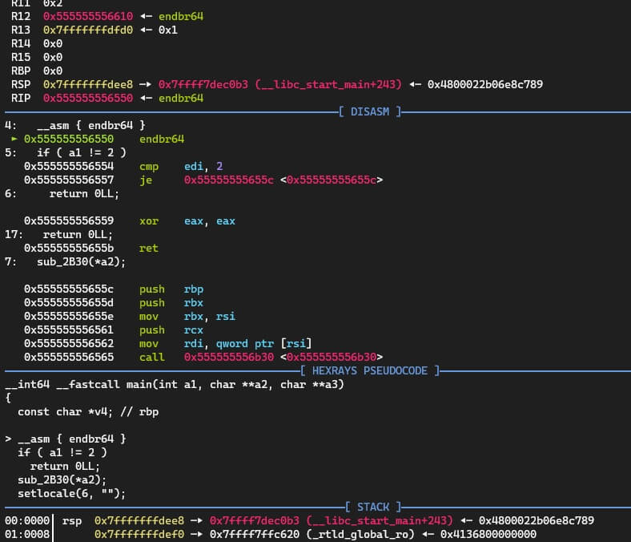

# pwndbg_ida_xmlrpc

Just rewrite https://github.com/pwndbg/pwndbg/blob/dev/ida_script.py into IDA plugin format, nothing specical. :P

https://github.com/pwndbg/pwndbg/blob/dev/FEATURES.md#ida-pro-integration

## Usage

- Install:
Copy pwndbg_xmlrpc.py into `%IDA%/plugins` directory.

- Use:
Click `Edit/Plugins/Pwndbg XML RPC`, `start` to start server, `stop` to stop server.

PS: WSL2 tcp forward
```
socat -d TCP-LISTEN:31337,reuseaddr,fork TCP:$(cat /etc/resolv.conf | tail -n1 | cut -d " " -f 2):31337
```

## Screenshot

